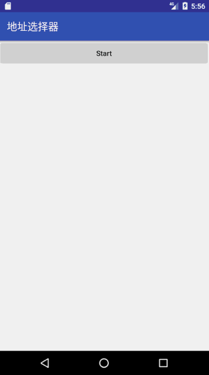

# AddressChecker
这是一个MD风格的地址选择器的示例，非常希望以及欢迎大家提交PR来完善它，如果有喜欢的同学可以直接拿到项目中使用。

此repo的数据（json文件）放在assets，repo中的`RequestCityListTask`负责从assets中读取数据，你可以替换成从服务器请求数据！

# 演示


# LICENSE
```text
Copyright 2017 Yan Zhenjie

Licensed under the Apache License, Version 2.0 (the "License");
you may not use this file except in compliance with the License.
You may obtain a copy of the License at

   http://www.apache.org/licenses/LICENSE-2.0

Unless required by applicable law or agreed to in writing, software
distributed under the License is distributed on an "AS IS" BASIS,
WITHOUT WARRANTIES OR CONDITIONS OF ANY KIND, either express or implied.
See the License for the specific language governing permissions and
limitations under the License.
```